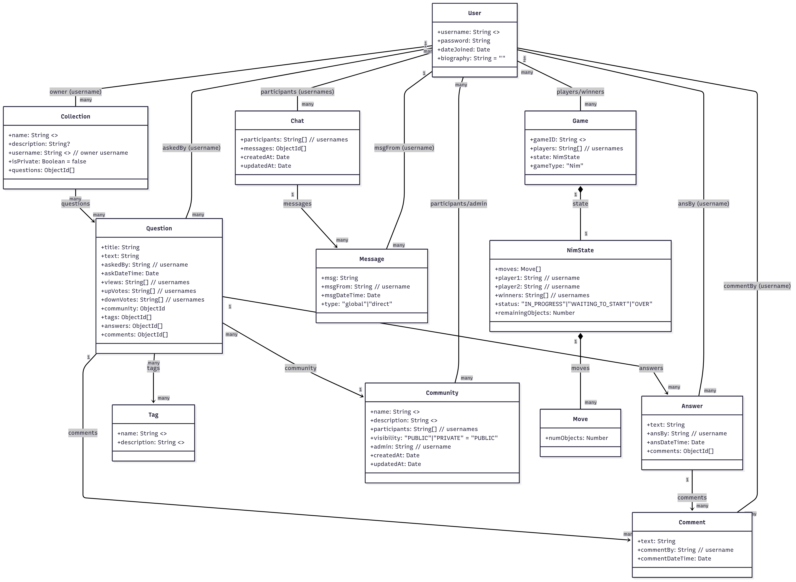

The individual and team project for this class are designed to mirror the experiences of a software engineer joining a new development team: you will be “onboarded” to our codebase, make several individual contributions, and then form a team to propose, develop and implement new features. The codebase that we’ll be developing on is a Fake Stack Overflow project (let’s call it HuskyFlow). You will get an opportunity to work with the starter code which provides basic skeleton for the app and then additional features will be proposed and implemented by you! All implementation will take place in the TypeScript programming language, using React for the user interface.

## Getting Started

Run `npm install` in the root directory to install all dependencies for the `client`, `server`, and `shared` folders.

{ : .note } Refer to [IP1](https://neu-se.github.io/CS4530-Spring-2025/assignments/ip1) and [IP2](https://neu-se.github.io/CS4530-Spring-2025/assignments/ip2) for further instructions related to setting up MongoDB, setting environment variables, and running the client and server.

## Codebase Folder Structure

- `client`: Contains the frontend application code, responsible for the user interface and interacting with the backend. This directory includes all React components and related assets.
- `server`: Contains the backend application code, handling the logic, APIs, and database interactions. It serves requests from the client and processes data accordingly.
- `shared`: Contains all shared type definitions that are used by both the client and server. This helps maintain consistency and reduces duplication of code between the two folders. The type definitions are imported and shared within each folder's `types/types.ts` file.

## Database Architecture

The schemas for the database are documented in the directory `server/models/schema`.
A class diagram for the schema definition is shown below:



## API Routes

### `/api/answer`

| Endpoint   | Method | Description      |
| ---------- | ------ | ---------------- |
| /addAnswer | POST   | Add a new answer |

### `/api/comment`

| Endpoint    | Method | Description       |
| ----------- | ------ | ----------------- |
| /addComment | POST   | Add a new comment |

### `/api/message`

| Endpoint     | Method | Description           |
| ------------ | ------ | --------------------- |
| /addMessage  | POST   | Add a new message     |
| /getMessages | GET    | Retrieve all messages |

### `/api/question`

| Endpoint          | Method | Description                     |
| ----------------- | ------ | ------------------------------- |
| /getQuestion      | GET    | Fetch questions by filter       |
| /getQuestionById/:qid | GET    | Fetch a specific question by ID |
| /addQuestion      | POST   | Add a new question              |
| /upvoteQuestion   | POST   | Upvote a question               |
| /downvoteQuestion | POST   | Downvote a question             |
| /getCommunityQuestions/:communityId   | GET   | Get questions in a specific community by communityId  |

### `/api/tags`

| Endpoint                   | Method | Description                                   |
| -------------------------- | ------ | --------------------------------------------- |
| /getTagsWithQuestionNumber | GET    | Fetch tags along with the number of questions |
| /getTagByName/:name             | GET    | Fetch a specific tag by name                  |

### `/api/user`

| Endpoint         | Method | Description                    |
| ---------------- | ------ | ------------------------------ |
| /signup          | POST   | Create a new user account      |
| /login           | POST   | Log in as a user               |
| /resetPassword   | PATCH  | Reset user password            |
| /getUser/:username        | GET    | Fetch user details by username |
| /getUsers        | GET    | Fetch all users                |
| /deleteUser/:username     | DELETE | Delete a user by username      |
| /updateBiography | PATCH  | Update user biography          |

### `/api/chat`

| Endpoint                    | Method | Description                                                                 |
| --------------------------- | ------ | --------------------------------------------------------------------------- |
| /createChat               | POST   | Create a new chat.                                                          |
| /:chatId/addMessage       | POST   | Add a new message to an existing chat.                                      |
| /:chatId                  | GET    | Retrieve a chat by its ID, optionally populating participants and messages. |
| /:chatId/addParticipant   | POST   | Add a new participant to an existing chat.                                  |
| /getChatsByUser/:username | GET    | Retrieve all chats for a specific user based on their username.             |

### `/api/games`

| Endpoint | Method | Description           |
| -------- | ------ | --------------------- |
| /create  | POST   | Create a new game     |
| /join    | POST   | Join an existing game |
| /leave   | POST   | Leave a game          |
| /games   | GET    | Retrieve all games    |

### `/api/collection`

| Endpoint                            | Method | Description                         |
| ----------------------------------- | ------ | ----------------------------------- |
| /create                             | POST   | Create a new collection             |
| /delete/:collectionId               | DELETE | Delete a collection                 |
| /toggleSaveQuestion                 | PATCH  | Add/remove question from collection |
| /getCollectionsByUsername/:username | GET    | Get collections by username         |
| /getCollectionById/:collectionId    | GET    | Get collection by ID                |

### `/api/community`

| Endpoint                    | Method | Description                      |
| --------------------------- | ------ | -------------------------------- |
| /getCommunity/:communityId  | GET    | Get a specific community         |
| /getAllCommunities          | GET    | Get all communities              |
| /toggleMembership           | POST   | Join/leave a community           |
| /create                     | POST   | Create a new community           |
| /delete/:communityId        | DELETE | Delete a community               |

## Running Cypress Tests (Optional)

Cypress tests are end-to-end tests that can help verify your implementation. These tests are provided as examples and running them is optional. Note that some tests may initially fail due to missing frontend implementations.

### Setup Instructions:

1. Navigate to the `testing` directory:
   ```sh
   cd testing
   ```

2. Install dependencies:
   ```sh
   npm install
   ```

3. Create a `.env` file in the `/testing` directory with the following content:
   ```
   MONGODB_URI=mongodb://127.0.0.1:27017
   ```

4. Make sure both the server and client are running in separate terminals

5. Run Cypress tests:
   ```sh
   npx cypress open
   ```

6. In the Cypress UI that opens:
   - Select "E2E Testing"
   - Choose your browser
   - Click on any test file to run it

**Note**: Running Cypress tests is optional. Cypress tests require significant system resources, and without them, the tests may be flaky. We will use these tests for grading.
